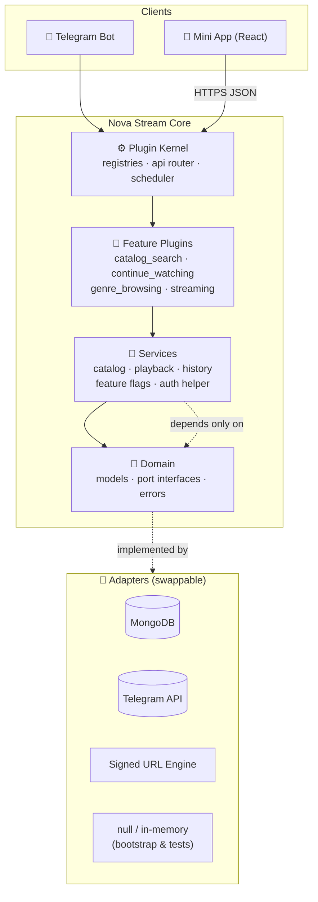
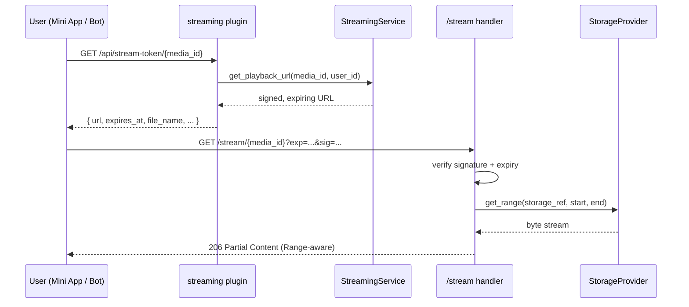

<div align="center">

# 🌌 Nova Stream

**A plugin-driven, ports-and-adapters media platform for Telegram — search, stream, and download, without vendor lock-in.**

[](LICENSE)
[](pyproject.toml)
[](pyproject.toml)
[](miniapp)
[](docs/architecture/overview.md)
[](ROADMAP.md)
[](CONTRIBUTING.md)

[Features](#-features) • [Architecture](#-architecture) • [Quick Start](#-quick-start) • [Configuration](#-configuration) • [API](#-api-reference) • [Roadmap](#-roadmap) • [Contributing](#-contributing)

</div>

---

## ✨ What is Nova Stream?

**Nova Stream** is an open-source media search, streaming, and download platform built around a Telegram bot and a companion **Mini App**. Point it at a channel full of media, and it turns that channel into a searchable, streamable, Netflix-like catalog — grouped by title, filterable by language/quality/codec, playable straight from a signed URL, no re-uploading, no third-party CDN.

What sets it apart isn't a feature list — plenty of Telegram media bots exist — it's *how it's built*:

- **Ports & adapters (hexagonal) architecture.** Every external dependency — the database, the search index, the file storage, the streaming engine, Telegram itself — sits behind an interface. Swap MongoDB for Postgres, or Telegram storage for S3, without touching a single feature.
- **A real plugin kernel**, not a folder of `if` statements. Adding a new content vertical (Anime, Music, Books, Live TV) is *writing a plugin*, not editing core files.
- **Bootstrap-first.** Every port has a `null`/in-memory adapter, so the entire application boots, wires, and runs its full test suite with **zero external services** — no database, no Telegram token, no Docker Compose required just to hack on it.

> 🚧 **Project status:** Nova Stream is in active, incremental development. The backend architecture, catalog search, variant grouping, genre browsing, continue watching, and the streaming/download pipeline are built and unit-tested. The Telegram bot's live polling loop, the admin dashboard, and several Mini App screens are still on the [roadmap](#-roadmap). See [`ROADMAP.md`](ROADMAP.md) for the exact, unvarnished state of every piece.

---

## 📸 Screenshots

<div align="center">

| Search | Browse Genres | Media Details | Player |
|:---:|:---:|:---:|:---:|
| _placeholder — add a screenshot_ | _placeholder — add a screenshot_ | _placeholder — add a screenshot_ | _placeholder — add a screenshot_ |

</div>

> Add real screenshots or a screen recording to `docs/assets/screenshots/` and swap the placeholders above.

---

## 🚀 Features

### Core catalog & discovery

| Feature | Status | Notes |
|---|:---:|---|
| 🔎 Smart search | ✅ | Text search across the catalog, powered by `SearchProvider` |
| 🧩 Variant grouping | ✅ | Same title in multiple languages/qualities/codecs collapses into one result with a variant picker |
| 🎭 Genre browsing | ✅ | `GET /api/genres/{genre}` — paginated, index-backed |
| ⏯️ Continue watching | ✅ | Server-tracked playback position per user, resumable from any client |
| 📄 Pagination | ✅ | Every list endpoint supports `offset`/`limit` |
| 🔥 Trending / 🆕 Recently added / 🖼️ Featured banner | 🗺️ Roadmap | Needs an aggregation/ranking pass on top of the existing catalog |
| ⌨️ Search suggestions / autocomplete | 🗺️ Roadmap | See [`ROADMAP.md`](ROADMAP.md) |

### Playback & delivery

| Feature | Status | Notes |
|---|:---:|---|
| ▶️ Streaming | ✅ | Signed, expiring URLs; range-request seeking |
| ⬇️ Download | ✅ | Same signed URL, tagged for `Content-Disposition: attachment` |
| 📴 Offline download | ✅ | Delegates to the device's native download manager — no bespoke storage layer needed |
| 🗂️ Storage-agnostic backend | ✅ | Ships a Telegram-backed adapter; S3/GCS/etc. are a new adapter, not a rewrite |

### Clients

| Feature | Status | Notes |
|---|:---:|---|
| 📱 Mini App (React) | 🟡 Partial | Search, Browse, Media Details, Player shipped; Watchlist/Settings/Downloads screens pending |
| 🤖 Telegram Bot UI | 🟡 Partial | Command/callback registries exist; the live polling loop is on the roadmap |
| 🛠️ Admin Dashboard | 🗺️ Roadmap | Feature-flag storage exists; the UI on top of it doesn't yet |

### Platform & operations

| Feature | Status | Notes |
|---|:---:|---|
| 🧱 Plugin system | ✅ | Auto-discovered provider & feature plugins, dependency-ordered loading |
| 🍃 MongoDB integration | ✅ | Real `DatabaseProvider` + `SearchProvider` adapters, codec-tested |
| 🧠 Caching | ✅ | Bounded, TTL in-process cache (no unbounded global dicts) |
| 📝 Structured logging | ✅ | |
| 🛡️ Error handling | ✅ | Every domain error maps to a stable HTTP status |
| 🚦 Rate limiting | 🗺️ Roadmap | |
| 🔐 Security hardening | 🟡 Partial | Signed URLs + auth port exist; a real `AuthProvider` (Telegram `initData`) is pending |
| 👥 User authentication | 🟡 Partial | `AuthProvider` port + `null` adapter wired everywhere; real adapter pending |
| 🔑 Channel verification | 🗺️ Roadmap | |
| 📢 Broadcast / 🔔 Notifications / 📊 Statistics / 💬 Inline search | 🗺️ Roadmap | Fully scoped in `ROADMAP.md`, not yet built |
| ✅ Automated tests | ✅ | Unit-tested at every layer that doesn't require live infrastructure |
| 📚 Documentation | ✅ | `docs/architecture/*`, `docs/api/reference.md`, inline design rationale throughout |

**Legend:** ✅ shipped · 🟡 partially shipped · 🗺️ planned, not yet built

---

## 🏗️ Architecture

Nova Stream draws a hard line between **ports & adapters** (for technical seams — database, search, storage, streaming, Telegram) and a **plugin kernel** (for feature seams — search, browsing, streaming, and future content verticals).



**Dependency direction is enforced, not just documented:**

```
plugins  →  kernel  →  services  →  domain (interfaces + models)
                                          ↑
        adapters (mongo, telegram, signed URLs, ...) — implement —┘
```

- `domain/` imports nothing else in the project.
- `services/` imports only `domain/` — never a concrete adapter.
- `kernel/` imports `services/` and `domain/`.
- `plugins/*` import only `kernel/` — never a concrete adapter, never another plugin.
- `server.py` (the composition root) is the *only* file allowed to wire a port to a concrete adapter.

These rules are checked by `import-linter` in CI, not just enforced by convention.

### Request flow: streaming a file



### Ports & their adapters

| Port | Purpose | Bootstrap adapter | Real adapter(s) |
|---|---|---|---|
| `SearchProvider` | Queryable, ranked catalog index | `null` | `mongo_text` |
| `StorageProvider` | Where file **bytes** live | `null` | `telegram` |
| `DatabaseProvider` / `Repository` | Where structured **records** live | `memory` | `mongo` |
| `StreamingService` | Signed playback URL issuance | `null` | `signed` |
| `AuthProvider` | Verifies caller identity | `null` | _(planned: Telegram `initData`)_ |
| `MetadataProvider` | Title/poster/rating enrichment | `null` | _(planned: TMDB/IMDb)_ |
| `TelegramGateway` | The only path to the Telegram API | `null` | `kurigram` |

Full detail: [`docs/architecture/overview.md`](docs/architecture/overview.md).

---

## 📁 Project structure

```
nova-stream/
├── src/media_platform/
│   ├── domain/              # Models, port interfaces, error hierarchy — zero internal deps
│   ├── services/            # Business logic, depends only on domain/
│   ├── kernel/               # Plugin runtime: registries, api router, scheduler, service locator
│   ├── plugins/
│   │   ├── providers/        # Adapters: database_mongo, storage_telegram, streaming_signed, ...
│   │   └── features/          # catalog_search, continue_watching, genre_browsing, streaming
│   ├── cache/                 # Bounded TTL cache
│   ├── config.py               # Environment-driven Settings
│   └── server.py                 # Composition root — the only file wiring ports to adapters
├── miniapp/                   # React + Vite + TypeScript + Tailwind Mini App
│   └── src/{pages,components,player,lib}/
├── tests/unit/                 # Fast, no-live-infrastructure-required test suite
├── docs/
│   ├── architecture/           # One doc per port/subsystem
│   ├── api/reference.md         # Full HTTP API reference
│   └── design-log/              # The "why", not just the "what"
├── ROADMAP.md
├── CHANGELOG.md
└── pyproject.toml
```

---

## ⚡ Quick Start

### Prerequisites

- Python **3.11+**
- Node.js **18+** and npm (only if you're working on the Mini App)
- *(optional)* A MongoDB instance and a Telegram bot token, for the real adapters — not required to run the bootstrap stack

### 1. Clone and install

```bash
git clone https://github.com/{{github.owner}}/nova-stream.git
cd nova-stream
python -m venv .venv && source .venv/bin/activate
pip install -e ".[dev]"
```

### 2. Run with zero configuration

Every port has a bootstrap adapter, so the platform runs immediately with no external services:

```bash
python -m media_platform.server
```

```
curl http://localhost:8080/healthz
```

### 3. Run the test suite

```bash
pytest
```

### 4. (Optional) Bring your own MongoDB + Telegram

```bash
pip install -e ".[mongo,telegram]"
cp .env.example .env    # then fill in the values you need
python -m media_platform.server
```

### 5. (Optional) Run the Mini App

```bash
cd miniapp
npm install
npm run dev
```

---

## ⚙️ Configuration

Nova Stream is configured entirely through environment variables — see [`.env.example`](.env.example) for the full, commented list. Nothing below is required to run the bootstrap stack; each group only matters once you opt into the matching real adapter.

<details>
<summary><strong>Core</strong></summary>

| Variable | Default | Purpose |
|---|---|---|
| `DATABASE_PROVIDER` | `memory` | `memory` or `mongo` |
| `SEARCH_PROVIDER` | `null` | `null` or `mongo_text` |
| `STORAGE_PROVIDER` | `null` | `null` or `telegram` |
| `STREAMING_PROVIDER` | `null` | `null` or `signed` |
| `AUTH_PROVIDER` | `null` | `null` (always unauthenticated) |
| `TELEGRAM_PROVIDER` | `null` | `null` or `kurigram` |

</details>

<details>
<summary><strong>Telegram</strong></summary>

| Variable | Purpose |
|---|---|
| `BOT_TOKEN` | Your bot's token |
| `API_ID` / `API_HASH` | From [my.telegram.org](https://my.telegram.org) |

</details>

<details>
<summary><strong>Streaming</strong></summary>

| Variable | Default | Purpose |
|---|---|---|
| `STREAM_SECRET` | _none — required for `signed`_ | HMAC key signing playback URLs |
| `PUBLIC_BASE_URL` | `http://localhost:8080` | Base URL baked into signed playback links |
| `STREAM_URL_EXPIRY_SECONDS` | `21600` (6h) | How long a signed URL stays valid |
| `STREAM_CHUNK_SIZE` | `1048576` (1MB) | Read chunk size from storage |
| `STREAM_WORKER_TOKENS` | _none — falls back to `BOT_TOKEN`_ | Comma-separated extra bot tokens for the streaming worker pool |

</details>

<details>
<summary><strong>Database</strong></summary>

| Variable | Purpose |
|---|---|
| `DATABASE_URL` | MongoDB connection string |

</details>

Full reference: [`.env.example`](.env.example).

---

## 🧭 Usage

### As a Telegram Bot

Nova Stream registers transport-agnostic bot commands (e.g. `/search`) through the same feature plugins that back the HTTP API — a command and an API route are two adapters over one `CatalogService`, never duplicated logic.

### As a Mini App

Launch the Mini App from your bot's menu button. It authenticates via Telegram's `initData`, then talks to the same JSON API documented below — search, browse by genre, open a title's variants, and stream or download, all from one WebView.

### As an API

Every route is documented with real request/response shapes in [`docs/api/reference.md`](docs/api/reference.md) — point any client (a custom frontend, a CLI, a second bot) at it directly.

---

## 📡 API Reference

A condensed index — see [`docs/api/reference.md`](docs/api/reference.md) for full request/response bodies.

| Method | Path | Auth | Purpose |
|---|---|:---:|---|
| `GET` | `/healthz` | — | Process/provider/plugin health check |
| `GET` | `/api/search` | — | Search the catalog, grouped by title + year |
| `POST` | `/api/media` | ✅ | Register a media item |
| `GET` | `/api/genres/{genre}` | — | Items tagged with a given genre |
| `GET` | `/api/continue-watching` | ✅ | The caller's in-progress items |
| `POST` | `/api/watch-progress` | ✅ | Record playback position |
| `GET` | `/api/stream-token/{media_id}` | ✅ | Issue a signed streaming URL |
| `GET` | `/api/download-token/{media_id}` | ✅ | Issue a signed download URL |
| `GET` | `/stream/{media_id}` | 🔏 signed URL | Range-aware byte stream |

---

## 🗺️ Roadmap

Nova Stream ships in phases, each documented in full in [`ROADMAP.md`](ROADMAP.md):

- [x] **Phase 1** — Architecture design
- [x] **Phase 2** — Project bootstrap (domain, kernel, null adapters)
- [x] **Phase 3** — Catalog search, variant grouping, continue watching, genre browsing
- [x] **Phase 4** — Streaming/download backend, Mini App core screens
- [ ] **Phase 5** — Telegram bot polling loop, real `AuthProvider`, Admin Dashboard
- [ ] **Phase 6** — Broadcast, notifications, statistics, inline search, channel verification
- [ ] **Future** — Additional content verticals (Anime, Music, Books, Live TV) as independent plugins

---

## 🤝 Contributing

Contributions are very welcome — see [`CONTRIBUTING.md`](CONTRIBUTING.md) for the workflow, [`docs/guides/coding-standards.md`](docs/guides/coding-standards.md) for style, and [`docs/guides/plugin-development.md`](docs/guides/plugin-development.md) for writing a new plugin. Please also read our [`CODE_OF_CONDUCT.md`](CODE_OF_CONDUCT.md).

Good first places to start:

- Pick an unchecked item from [`ROADMAP.md`](ROADMAP.md)
- Add a new `MetadataProvider` or `AuthProvider` adapter
- Build a Mini App screen (Watchlist, Settings, Downloads) following the existing page pattern

---

## 🙌 Credits

**Created and maintained by [SHAZ BOTS](https://t.me/shazbotz)**

- GitHub: [SHAZ BOTS](https://github.com/shazbotz)
- Contact: https://t.me/shamil_shaz03
  

---

## 📄 License

Nova Stream is licensed under the **Apache License 2.0** — see [`LICENSE`](LICENSE) for the full text.

<div align="center">

**If Nova Stream is useful to you, consider starring the repo ⭐**

</div>
